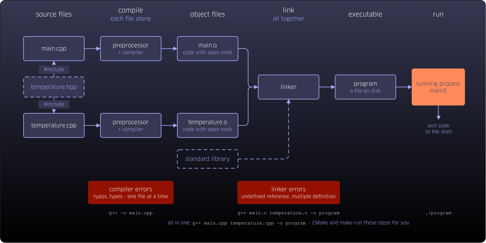
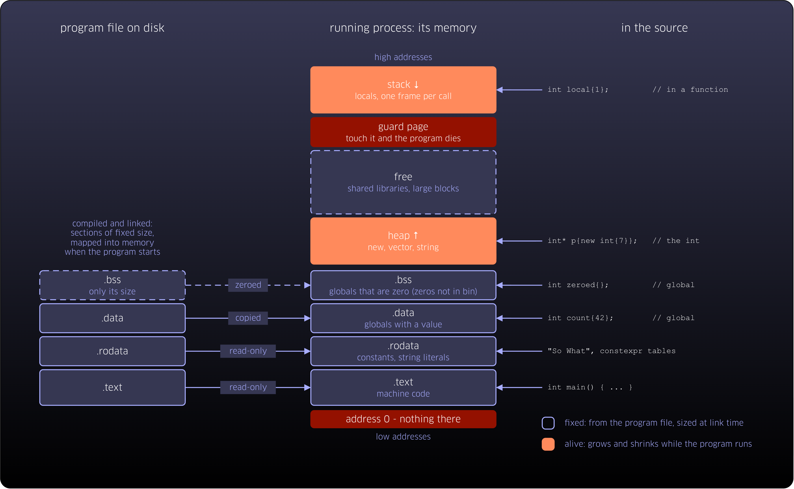

[© A.Voß, FH Aachen, codebasedlearning.dev](mailto:info@codebasedlearning.dev)

# Unit 0x01 - Up and Running

The executable runs, not the source. This unit gets you from a text file to a running program: first in the terminal,
where `g++` compiles and links and `make` remembers how, then in CLion, where CMake does the same behind the scenes.
Then far enough to solve first small tasks - variables, strings, loops, functions, input and output, much as in Java.
On the way, a first look underneath: every variable is a few bytes at an address, and the debugger shows them. And a
first lesson about the machine: when something goes wrong, e.g. a variable without a value or an `int` that grows too
large, there is no exception and no helpful message. The program goes on with nonsense, or it stops, without a word
about why.

## Two pictures

How a text file becomes a running program - and where the parts of that program end up in memory. Both pictures come
back in later units.

## Start

Start with the tasks from [`tasks.md`](tasks.md).

## Comments

Questions, improvements, or clever suggestions? Send friendly notes (and constructive critique) to
[me](mailto:info@codebasedlearning.dev).
